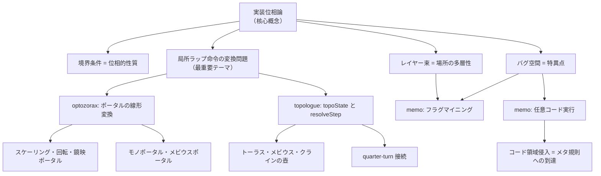

# 実装位相論：筆者の興味関心まとめ

> 本稿は `opportunity.md`、`memo.md`、`optozorax.md`、`topologue_v05.htm` の4ファイルから、筆者の関心を横断的にまとめたものである。

---

## 核心テーマ：「実装位相」

筆者の最も根本的な関心は、**数学的な位相空間の概念を、計算機上の実装構造から再発見・再構築すること**にある。ここでいう「実装位相」とは、配列・座標変換・境界条件・バグ挙動といった実装上の機構から「空間らしさ」や「接続の性質」がいかに立ち上がるかを考察する立場である。

### 空間は「容器」ではなく「接続規則の総体」である

- 二次元マップは内部的には `index = y * width + x` の一次元配列に過ぎない
- 隣接関係（上下左右）は幾何学的に自明なのではなく、**添字の計算規則によって人工的に定義**されている
- 位相的性質（トーラス、メビウスの帯、クラインの壺など）は図形の形からではなく、**境界での遷移規則**から生じる

---

## 最重要テーマ：局所ラップ命令の変換問題

> **「空間の性質を指定するラップ命令そのものが空間の局所に『存在』していた時に、それを変換（線形変換など？）するとどうなるのか」**

これは筆者にとって最も重要な問いである。通常、ラップ処理やワープ処理は世界全体に一様な規則として理解されるが、実装上は座標ごとのテーブルや境界マスの属性として**局所化**されている場合がある。

このとき：
- 接続規則が局所データであるなら、それを**書き換える**ことは空間の位相そのものの局所変形を意味する
- 接続規則に**線形変換**（回転・反転・スケーリング・剪断）を施すと、空間の大域構造がどう変化するか
- 空間は固定的な容器ではなく、**局所遷移写像の束（ファイバーバンドル的構造）**として理解されるべき

### 関連する発展方向

| 方向 | 概要 |
|------|------|
| 局所接続規則の一般化 | 各マスが独自の接続規則を持つ空間モデル |
| アフィン変換的ラップ | ラップ時に座標変換（回転・反転など）を伴う境界条件の位相的意味 |
| 状態依存接続 | フラグ・時間・所持品によって接続先が変わる動的空間 |

---

## 関心領域①：ゲーム実装から見た空間の構造

### レイヤー空間論

ゲームでは1マスに複数のレイヤー（地形・キャラクタ・アイテム・イベント属性）が重なる。これらは内部的に**別配列**として保持されており、「1つの場所」とは厳密には**複数の一次元列にまたがる添字の同期現象**である。

### バグ空間と特異点

範囲外参照やオーバーフローにより生じる「バグ空間」は、空間を実現していた配列構造が露出した状態とみなせる。バグは破綻ではなく、**空間を成立させていた局所規則が露出する契機**である。

### 存在論の離散化

ゲーム内キャラクタには複数の表現（キャラ番号・種族番号・描画番号・状態フラグ・座標）があり、異常系では「半存在」が生じる。存在とは二値ではなく、**論理的存在・描画上の存在・行動主体としての存在・衝突判定としての存在**の多層構造である。

### コード領域への侵入

空間内の移動がプログラムのコード領域に到達したとき、それは「空間の外」ではなく**空間生成の上位層**への到達を意味する。

---

## 関心領域②：SFCシレンの「フラグマイニング」と任意コード実行

`memo.md` は、SFCの「不思議のダンジョン2 風来のシレン」におけるバグ研究の動画書き起こしであり、筆者の実装位相論の具体的素材を示している。

### フロア変数の壁先接続

- フロアの各マスは4つのレイヤー（マップ可否・キャラクタ・アイテム・地形）を持つ
- 座標 `(0,0)` ～ `(63,41)` の外側（異常座標）にアクセスすると、イベントフラグやフロアデータなど本来別用途のメモリ領域と干渉する
- この現象は `opportunity.md` で述べられた「バグ空間」「レイヤー束」「コード領域侵入」の実例そのもの

### フラグマイニング → 任意コード実行

- 異常座標のキャラクタ/道具データを操作してイベントフラグを書き換える技術（フラグマイニング）
- さらにスタックポインタのアドレスを書き換え、コントローラ入力領域を経由してジャンプ先を制御する**スタックチェーン**により任意コード実行に到達
- これは実装位相論でいう「世界の規則への到達」＝空間内の操作がメタ規則の書き換えに至る現象の実証例

---

## 関心領域③：ポータルの幾何学（optozorax の研究）

`optozorax.md` は、ポータル（空間接続）の幾何学的性質を探求するYouTube動画シリーズの書き起こしである。筆者はこれを実装位相論の参考資料として収集している。

### ポータルの基本性質

- ポータルは「ドアウェイ（出入口）」を切断して空間を接続したもの
- 2つのポータルを背中合わせに接続すると通常のドアウェイに戻る（第一性質）
- ポータルは**線形変換**（移動・回転・鏡映・スケーリング・剪断）を空間に施す

### ポータルが施す線形変換

| 変換 | 効果 |
|------|------|
| 移動・回転 | 通常のポータル |
| 鏡映 | 入ると左右が反転する世界へ |
| スケーリング | 物体を拡大・縮小（Superliminalのポータル） |
| 剪断（スキュー） | 座標軸を歪める |

### 高度なポータル構造

- **トリプルポータル**：3つの宇宙を接続する3面ポータル
- **モノポータル**：1つの面しか持たないポータル（非鏡映的な鏡）
- **メビウスの帯ポータル**：片面しかない構造からポータルを構成
- **トレフォイル結び目ポータル**：結び目理論とポータルの融合
- **ポケット次元**：小さなポータルを自分自身の中に入れると「袋小路次元」が生成される

### 実装位相論との接点

optozorax の研究は、筆者の「局所ラップ命令に線形変換を施すとどうなるか」という問いに直接対応する：
- ポータルの入出力に線形変換を与えることで空間の大域構造が変わる
- テレポーテーション次数（何回テレポートされたか）の概念は、実装位相論における「空間規則の入れ子構造」に対応
- ポータルのタイリング（正方形・六角形・三角形の周期的配置）は、実装上の周期境界条件に対応

---

## 関心領域④：位相ローグライク試作（topologue_v05.htm）

`topologue_v05.htm` は、実装位相論を**実際にゲームとして実装した**最小試作である。

### 実装されている位相空間

| topology | 数学的対応 |
|----------|-----------|
| `plane` | ユークリッド平面（境界あり） |
| `torus` | トーラス（左右上下がラップ） |
| `mobius-horizontal` | メビウスの帯（横境界で上下反転） |
| `klein-horizontal` | クラインの壺 |
| `double-twist` | 二重ひねり |
| `quarter-clockwise` | 90度回転接続 |
| `quarter-clockwise-twist` | 90度回転＋ひねり接続 |

### 実装の核心

- `resolveStep(x, y, dir, topoState, width, height)` が各トポロジーの「ラップ命令」そのもの
- `topoState`（`flipX`, `flipY`, `rot`）が空間の局所的な向き情報を保持 → **局所ラップ命令の状態**
- 境界を超えるたびに `topoState` が更新され、空間の見え方が変化する
- `LocalChart` クラスがプレイヤー周囲の局所地図を BFS で展開し、「真の空間」と「見えている空間」を分離

---

## テーマ間の関連図

---

## まとめ：筆者が追求する問い

1. **空間の性質は、いかにして実装上の接続規則から立ち上がるか**
2. **接続規則（ラップ命令）が空間の局所に存在するとき、それを変換するとどうなるか**（← 最重要）
3. **バグや異常系は、空間の成立条件をどのように露出させるか**
4. **ポータルの幾何学は、実装位相論にどのような数学的枠組みを提供しうるか**
5. **これらの知見を、実際にゲーム（位相ローグライク）として実装・体験できるか**
