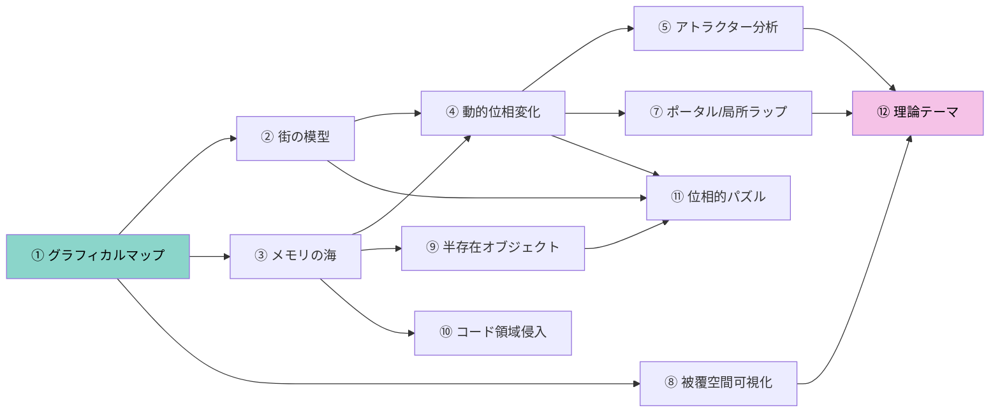

# 実装位相論プロジェクト：研究・実装ロードマップ

> `topologue_v05.htm` の現状（ASCII表示、7種のTopologyクラス、犬猫AI、LocalChart BFS）を起点に、理論的探究と実装の両面を整理する。

---

## ① グラフィカルマップ

### 描画システム選定

| 候補 | 長所 | 短所 | 推奨場面 |
|------|------|------|----------|
| **Canvas 2D** | パフォーマンス良好、ピクセル制御自在、大マップでも安定 | DOM要素として扱えない、アクセシビリティ弱 | **メインビュー推奨** |
| **SVG** | 拡縮に強い、DOM操作で要素ごとにイベント付与可 | ノード数多いと遅い | ミニマップ/力学系ダイアグラム |
| **DOM Grid** | CSSアニメーション・ホバーが自然、デバッグ容易 | 数百セルで限界 | 小規模デバッグビュー |

**推奨構成**：メインビューを **Canvas 2D**、ミニマップ/デバッグを **SVG or DOM**。

### タイルセット設計

最初は `fillRect` による色分け矩形で十分。設計だけ先に切っておく：

```
TileRenderer {
  tileSize: 24,
  palette: {
    floor:    '#2a2d3a',
    wall:     '#4a4e5e',
    player:   '#8bd5ca',
    dog:      '#f5c2e7',
    cat:      '#fab387',
    food:     '#a6e3a1',
    trail:    '#585b70',
    visited:  '#313447',
    seen:     '#252738',
    boundary: '#f38ba8',  // 境界をまたいだ瞬間ハイライト
    memory_sea: '#1a0a2e', // メモリの海（③用）
  }
}
```

### 境界越え視覚フィードバック

- `topoState` が変化した瞬間に **画面全体に 0.15s のフラッシュ**（`CSS filter: brightness(1.5)` → 戻し）
- メビウスで `flipY` 反転時は **上下が一瞬スワップするアニメーション**
- quarter-turn で `rot` 変化時は **画面が90度回転するトランジション**
- ミニマップ側で「今どのタイルコピーにいるか」をハイライト

### モバイル対応

Canvas 上に半透明の仮想パッド（十字キー）をオーバーレイ。`touch` イベントで方向判定。

---

## ② トポロジーの街の模型

### ゾーン構造設計案

```
┌─────────────────────────────────────┐
│          外 周 道 路 (torus)          │
│  ┌──────────┐     ┌──────────┐      │
│  │  広 場    │─ド─│  路地裏   │      │
│  │ (plane)  │ ア │ (möbius) │      │
│  └────┬─────┘     └──────────┘      │
│       │ドア                          │
│  ┌────┴─────┐                       │
│  │ 建物内部  │                       │
│  │(klein/   │                       │
│  │ pocket)  │                       │
│  └──────────┘                       │
└─────────────────────────────────────┘
```

### CompositeTopology の設計

現在の `resolveStep(x, y, dir, topoState, width, height)` はマップ全体に一様なトポロジーを適用している。ゾーン化には2つのアプローチがある：

**案A：ノード単位の接続規則**（推奨）
- `WorldNode.neighbors` を直接編集して、ドアのノードには別ゾーンのノードを接続
- 既存の `buildWorldGraph` 後に「ドア接続」をポストプロセスとして追加
- `topoState` はゾーンごとに独立 → ドアを通るとリセットされる

**案B：CompositeTopology クラス**
- ゾーンIDを持つ `resolveStep` が、座標に応じて委譲先の Topology を切り替える
- より宣言的だが、ゾーン境界判定が複雑

### NPC行動とゾーン境界

- **犬（追跡AI）**：BFS距離計算がゾーン境界を正しく越える必要がある。トーラスゾーンでの「近道」が劇的に距離を変える → **ログに「犬はトーラスを通ってショートカットした」と表示**
- **猫（探索AI）**：メビウスゾーンでは `visitedSet` のノードに到達しても `topoState` が異なるため未訪問扱い → **猫が同じ場所をぐるぐる回る**（これは面白い挙動）
- **ゾーントランジション演出**：ドアを通る瞬間にログに位相変化を出力 +  色調変化

---

## ③ メモリの海

### メモリレイアウト設計

シレンの「フロア変数の壁先接続」を忠実に再現するレイアウト：

```
Uint8Array (totalSize bytes)
├── [0x0000 - 0x00FF]  ゲーム状態ヘッダ
│   ├── [0x00] ターン数下位
│   ├── [0x01] ターン数上位
│   ├── [0x02] トポロジーID (0=plane, 1=torus, 2=mobius, ...)
│   ├── [0x03] トポロジーパラメータ (twistX, twistY, etc.)
│   ├── [0x04] プレイヤーX
│   ├── [0x05] プレイヤーY
│   ├── [0x06] プレイヤーtopoState (flipX|flipY|rot)
│   ├── [0x07] 犬X
│   ├── [0x08] 犬Y
│   ├── [0x09] 犬scaredTurns
│   ├── [0x0A] 猫X
│   ├── [0x0B] 猫Y
│   ├── [0x0C] 猫sleepTurns
│   ├── [0x0D] 猫sleepiness
│   ├── [0x0E-0x0F] 食料数
│   ├── [0x10-0x1F] イベントフラグ領域 (16 bytes)
│   └── [0x20-0xFF] 予約 / 未使用
│
├── [0x0100 - 0x0100+W*H-1]  マップレイヤー0：地形
│   └── 値: 0=床, 1=壁, 2-255は拡張用
│
├── [0x0100+W*H - 0x0100+2*W*H-1]  マップレイヤー1：キャラクタ
│   └── 値: 0x80=空, 0x00=プレイヤー, 0x01=犬, 0x02=猫, ...
│
├── [0x0100+2*W*H - 0x0100+3*W*H-1]  マップレイヤー2：アイテム
│   └── 値: 0x80=空, その他=アイテムID
│
├── [0x0100+3*W*H - 0x0100+4*W*H-1]  マップレイヤー3：イベント属性
│
└── [残り]  未使用 / ゼロ埋め
```

### 壁先接続の再現

正規マップ座標 `(x, y)` は `0 ≤ x < W`, `0 ≤ y < H` だが、座標系は `0 ≤ x < 256`, `0 ≤ y < 256` まで拡張可能。

- 異常座標 `(x, y)` のキャラクタレイヤーの値は `memory[0x0100 + W*H + y*256 + x]` を読む
- この領域にはイベントフラグ領域やトポロジーパラメータが**物理的に隣接**している
- したがって、異常座標で「キャラを倒す」＝そのメモリを `0x80` に書き換える＝**イベントフラグの書き換え**

### 「ゼロの矢」演出

メモリ値が `0x00` の領域は「キャラ番号0の幽霊」として描画される → メモリの海に入ると大量の幽霊が見える。

### ビジュアル表現

- 正規マップ：通常の色調
- メモリの海：**紫がかった暗色** + **ノイズシェーダー**（Canvas の `globalAlpha` で毎フレーム微小にランダムピクセルを描画）
- 境界：正規マップの枠を **赤い点線** で囲む
- イベントフラグ領域：**金色に輝くセル** として特別表示

---

## ④ 動的位相変化

### トポロジー変換器

マップ上に特殊タイル `T` を配置。踏むと現在のトポロジーが変化する：

```javascript
class TopologyTransformer {
  constructor(nodeId, fromTopology, toTopology) {
    this.nodeId = nodeId;
    this.from = fromTopology;  // null = any
    this.to = toTopology;
  }

  apply(game) {
    const prev = game.topology.name;
    game.topology = createTopology(this.to);
    game.worldGraph = buildWorldGraph(game.baseMap, game.topology);
    game.topologyLog.push({ turn: game.turn, from: prev, to: this.to });
    addLog(game, `空間が変容した: ${prev} → ${this.to}`);
  }
}
```

### メモリの海との連動

`memory[0x02]`（トポロジーID）を異常座標から書き換えると、正規マップに戻った瞬間にトポロジーが変化する：

1. メモリの海でトポロジーIDのセルに到達
2. アイテムを置く（=値を書き換える）
3. 正規マップに戻る
4. `syncFromMemory()` でトポロジーが再構築される
5. ログに遷移が記録される

### 遷移ログ UI

サイドパネルに遷移履歴を表示：

```
[Turn 0]   torus
[Turn 15]  torus → möbius  (変換器)
[Turn 42]  möbius → klein  (メモリ書き換え)
[Turn 58]  klein → torus   (変換器)
```

---

## ⑤ アトラクターの分析

### 状態空間の定義

取りうるトポロジーを有限集合 `T = {plane, torus, mobius, klein, double-twist, quarter-cw, quarter-ccw, quarter-cw-twist, quarter-ccw-twist}` として、$|T| = 9$。

### 遷移テーブルの構築

各変換器 $f_i: T \to T$ の作用を記録。例えば：

| 操作 | plane→ | torus→ | mobius→ | klein→ | ... |
|------|--------|--------|---------|--------|-----|
| 変換器A | torus | mobius | klein | plane | ... |
| 変換器B | mobius | torus | torus | mobius | ... |
| メモリ書き換え | (任意) | (任意) | (任意) | (任意) | ... |

### 検出すべき構造

- **不動点**：$f(t) = t$ となるトポロジー。「この操作をしても変わらない空間」
- **周期軌道**：$f^n(t) = t$ となる最小の $n$。メビウスを2回ひねるとトーラスに戻る、など
- **吸収状態**：一度入ると抜け出せないトポロジー
- **アトラクター盆地**：初期トポロジーごとの収束先の分類
- **可逆性**：$f$ に逆 $f^{-1}$ が存在するか。存在しない場合、情報が失われている

### 可視化

SVG で状態遷移グラフを描画。ノード＝トポロジー、辺＝変換。アトラクターは **太い赤枠のノード**、周期軌道は **閉じた赤い矢印** で表示。

---

## ⑥ 予備提案群（再掲 + 拡張）

### 逆フラグマイニング

メモリの海で NPC の内部状態バイトを書き換える：

| 対象 | アドレス | 効果 |
|------|---------|------|
| 猫sleepTurns | `0x0C` | 0に → 即座に起きる |
| 猫sleepiness | `0x0D` | 255に → 次ターン寝落ち |
| 犬scaredTurns | `0x09` | 10に → 長時間逃走 |

**パズル要素**：「メモリの海で猫の眠気値を操作して、猫を特定ゾーンに誘導した状態でドアを通らせる」

### 音

- トーラス：ループする環境音
- メビウス：音が左右反転（ステレオ逆転）
- quarter-turn：音が90度ずつパンする
- メモリの海：ローファイ・グリッチ音

### リンゴの皮むきビューワー

サイドパネルに一次元メモリ列を可視化し、`index = y * width + x` の関係を表示。

---

## ⑦ ポータルとの接続：局所ラップ命令の変換理論

> これは理論面で最も深い方向。

### 概念

現在の `resolveStep` は**マップ全体に一様**な接続規則を持つ。しかし optozorax のポータル研究が示唆するのは、**各ノード（セル）が独自の接続規則（局所ポータル）を持てる**構造である。

### NodePortal クラス

```javascript
class NodePortal {
  constructor(nodeId, dir, targetNodeId, transform) {
    this.nodeId = nodeId;          // ポータルが存在するノード
    this.dir = dir;                // どの方向に踏むと発動するか
    this.targetNodeId = targetNodeId; // 接続先ノード
    this.transform = transform;    // { rotation, flipX, flipY, scale }
  }
}
```

これにより：
- 特定マスの東に「90度回転して出る」ポータルを配置
- 特定マスの北に「鏡像反転して出る」ポータルを配置
- ポータル自体をメモリの海に配置して、メモリ書き換えで接続規則を変える

### 変換の合成（ファイバーバンドル）

ポータルの連鎖を通ると変換が合成される：

$$T_{total} = T_n \circ T_{n-1} \circ \cdots \circ T_1$$

これは `topoState` の逐次更新そのもの。ホロノミー（一周して元に戻った時の変換の残り）が空間の大域的性質を決定する。

### 実装アイデア

1. `buildWorldGraph` の後処理でノード単位のポータルを追加
2. `resolveStep` をオーバーライドして、ノードポータルがある場合はそちらを優先
3. ポータルの配列をメモリの海に配置 → メモリ書き換えでポータルの接続先や変換を変更可能

---

## ⑧ 被覆空間と展開図の可視化

### 概念

トーラス上を歩くプレイヤーの視界は、実は**トーラスの普遍被覆空間（＝ユークリッド平面）を局所的に切り出したもの**。現在の `LocalChart` の BFS がまさにこれを計算している。

### 実装アイデア

- **展開図モード**：`LocalChart` が作る局所地図を、正規マップの何倍も広い平面上に描画。同じノードが複数箇所に現れることで、位相の「ひねり」が可視化される
- **メビウス展開図**：帯状に展開すると、上下が反転した「裏面」が見える
- **quarter-turn展開図**：4回で元に戻る回転接続が、平面上では4つの回転コピーとして現れる
- 既存の `TiledChart` がこの方向の実装基盤をすでに持っている

### 理論的意義

これは「局所から大域をいかに再構成するか」という位相幾何学の中心問題であり、`LocalChart` → `被覆空間` → `ホロノミー計算` という流れで実装位相論のコアに接続する。

---

## ⑨ 存在論の離散化：半存在オブジェクト

### 概念

`opportunity.md` が提起した「存在判定・描画・行動主体・衝突判定の分離」を実装する。

### 実装

```javascript
class Entity {
  logicallyExists;  // メモリ上に存在する
  isDrawn;          // 描画される
  isColliding;      // 衝突判定がある
  isActing;         // AI が動く
}
```

メモリの海で各フラグのバイトを個別に書き換えると：

| 状態 | 効果 |
|------|------|
| 存在するが描画されない | 透明な壁。ぶつかるが見えない |
| 描画されるが存在しない | 幽霊。見えるがすり抜ける |
| 行動するが衝突しない | 霊体の犬。追ってくるが触れない |
| 衝突するが行動しない | 石像。動かないが通れない |

### 理論的意義

ゲーム内の「存在」は二値ではなく多層。これはファイバーバンドルの各層に「存在の次元」が対応する構造と見なせる。

---

## ⑩ コード領域侵入の再現

### 概念

シレンの任意コード実行に相当する体験を安全に再現する。

### 設計

メモリの海のさらに奥（高アドレス領域）に**ゲームの実行周期テーブル**を配置：

```
[0x1000 - 0x10FF]  命令テーブル
  各バイトが「ターンごとに実行される命令」のインデックス
  0x00 = NOP
  0x01 = 犬を1マス移動
  0x02 = 猫を1マス移動
  0x03 = 食料スポーン判定
  0x04 = topoStateリセット
  0x05 = トポロジー変換
  …
  0xFF = 全NPCを消去
```

- 通常プレイでは到達不可能
- 特定のバグ的操作（猫のスリープ中に犬で特定操作…）で到達可能にする
- 命令テーブルを書き換えると、ゲームのルール自体が変わる
- **安全装置**：命令テーブルに「無限ループ」を書いても検出して停止する

### 理論的意義

「空間内の移動が、空間を生成しているメタ規則に到達する」体験の直接的実装。

---

## ⑪ 位相的ゲームメカニクス

### ホモロジー検出器

マップ上の「穴」を自動検出するアイテム。

- BFS で到達可能なノードを特定
- 壁で囲まれた領域の接続成分を数え上げる
- 結果をサイドパネルに表示：「この空間には ${n} 個の穴があります」
- トポロジーが変わると穴の数も変わるので、動的変化の指標になる

### テレポーテーション次数

optozorax のポータル研究から着想。プレイヤーが境界をまたいだ回数を「テレポーテーション次数」として記録し、同じマスでも次数が異なれば色を変えて表示。

### 経路のホロノミー測定

特定の経路を一周した時に `topoState` がどう変化したかを記録・表示する。

- `rot` が1増えた → 「空間は90度回転しています」
- `flipY` が反転 → 「空間は向こう岸のメビウスです」
- 変化なし → 「この経路は位相的に自明です」

### 位相的パズル

- 「メビウスゾーンを2周して元の向きに戻らないと開かないドア」
- 「quarter-turnゾーンを4周して rot=0 に戻すとアイテムが出現」
- 「犬と猫が同じノードにいるが topoState が異なっているので見えない → メモリの海で猫の topoState を書き換えて可視化する」

---

## ⑫ 調べるべき理論テーマ

実装に直接つながる数学的トピックを整理する。

### 被覆空間論

| テーマ | 実装との対応 |
|--------|-------------|
| 普遍被覆空間 | `LocalChart` の BFS 展開 |
| デッキ変換群（被覆変換群） | `topoState` の有限群構造 |
| 基本群 $\pi_1$ | 閉路のホロノミー分類 |
| 分岐被覆 | メモリの海の特異点 |

### ファイバーバンドル

| テーマ | 実装との対応 |
|--------|-------------|
| 底空間 | `BaseMap`（ノード集合） |
| ファイバー | `topoState`（各ノード上の局所状態） |
| 構造群 | `topoState` の変換群 |
| 接続（connection） | `resolveStep` のトポロジー操作 |
| ホロノミー | 閉路一周後の `topoState` の変化 |
| 曲率 | 微小閉路のホロノミー |

### 離散微分幾何

| テーマ | 実装との対応 |
|--------|-------------|
| 離散ガウス曲率 | ノード周りの角度欠損 |
| 離散接続 | 辺ごとの変換行列 |
| ガウス・ボネの定理 | ホロノミーの総和＝オイラー数×2π |
| 平行移動 | `topoState` の輸送 |

### グラフ理論

| テーマ | 実装との対応 |
|--------|-------------|
| ケイリーグラフ | 被覆空間のグラフ表現 |
| スペクトルグラフ理論 | マップの固有値→位相的性質の検出 |
| グラフホモロジー | 穴の検出 |
| 展開木 | BFS ツリー＝局所地図 |

### 力学系

| テーマ | 実装との対応 |
|--------|-------------|
| 離散力学系 | トポロジー遷移テーブル |
| アトラクター | ⑤の分析対象 |
| エルゴード性 | NPCの探索がマップ全体をカバーするか |
| シンボリック・ダイナミクス | NPCの移動パターンのシンボル列化 |

---

## 実装の優先順位（提案）



> **①が全ての土台**。次に②③を並行で進め、④⑤で動的体験を作り、⑦⑧⑫で理論的深化へ向かう。

---

## 次に着手すべき具体的タスク

| # | タスク | 出力物 | 依存 |
|---|--------|--------|------|
| 1 | Canvas 2D 描画層を `topologue_v05.htm` に追加 | `renderCanvas()` 関数 | なし |
| 2 | タイルパレット定数と `drawTile(ctx, x, y, type)` | パレットオブジェクト | 1 |
| 3 | LocalChart → Canvas 描画の変換 | 既存 `renderChart` の Canvas 版 | 1,2 |
| 4 | 境界越えフラッシュエフェクト | CSSアニメーション + JS トリガー | 3 |
| 5 | ミニマップ（真世界を Canvas で小さく描画） | `renderMinimap()` | 1,2 |
| 6 | メモリ配列の設計と `MemorySpace` クラス | `Uint8Array` + アクセサ | なし |
| 7 | 異常座標の到達手段の実装 | 特殊タイル or バグ操作 | 6 |
| 8 | `CompositeTopology` or ポストプロセス方式のゾーン接続 | ゾーン対応のグラフ構築 | なし |
| 9 | トポロジー変換器のプロトタイプ | `TopologyTransformer` クラス | なし |
| 10 | 遷移ログ UI | サイドパネル表示 | 9 |
